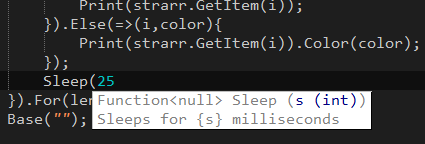

# Notepad Extensions

## Syntax Highlighter
This is a basic syntax highlighter for Notepad++. The file appended with `-light` can be used with *most* themes(light or dark) while the one appended with `-dark` is tailored for dark themes only. To install, click `Language` -> `Define Your Language` -> `Import`

## AutoComplete and ToolTip Extension
To enable AutoComplete and ToolTips for your `.ts` files, take the .xml file in the `plugins/APIs` directory above, and put it in your `notepad++/plugins/APIs` directory. This plugin only works if you're using one of the Syntax Highlighters above!

The tooltips give you a brief description of a function when you open parameters, as well as the expected arguments and return value. Tooltips also work for extensions!
