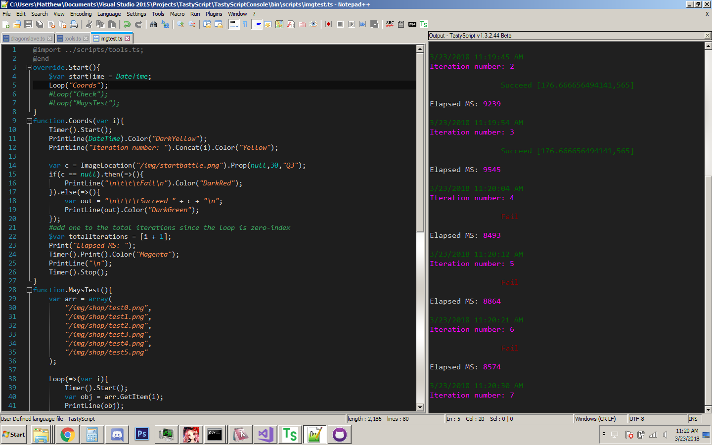

# TastyScript
[](https://github.com/TastyGod/TastyScript/releases)
[](https://paypal.me/MatthewAndrews88/5)

TastyScript is an open source programming language designed to automate Android devices via location based touch events. The main purpose was to achieve support for game automation on native Android devices with a lightweight and robust system.

At the core, TastyScript sends simple commands to an ADB Shell (`input tap x y`), which are then sent to the device and executed. As of writing this(v1.3.2), TastyScript supports Touch, LongTouch, Swipe, SendText, KeyEvent, and a couple of screen shot features(CheckScreen, ImageLocation, and TakeScreenshot) which utilize the FrameBuffer to grab the screen directly from the device(without leaving screen shots on your device). 

***Disclaimer*** TastyScript was designed for being used with games/apps which explicitly state that they allow macros/botting. DO NOT ask how to bot in `x` game without being able to provide the section of the games TOS allowing it; we will not help you cheat. We are not responsible for any undesired effects that occur due to you ignoring this disclaimer. Use this software at your own risk.

## Getting Started

These instructions will get you a copy of the project up and running on your local machine.

### Prerequisites

[The latest TastyScript release](https://github.com/TastyGod/TastyScript/releases)

[Android ADB](https://developer.android.com/studio/releases/platform-tools.html)

Windows 7+ with .Net 4.5 or above

Android phone/tablet/emulator

[Notepad++](https://notepad-plus-plus.org/) If you wish to use the Notepad++ plugin and extensions(such as the syntax highlighter and Function ToolTips)

### Installing

1) Unzip the Android ADB file you downloaded.
2) Open up a Command Prompt in the directory you unzipped to and type in `adb devices` to make sure your device shows up.
3) Unzip the TastyScript release you downloaded.
4) Double click the `TastyScriptConsole.exe` and type in `devices` to make sure your device shows up.

And thats all there is to installation! I suggest you make a folder inside the TastyScript release folder called `scripts` where you can keep all your script files. To run a script, type in the TastyScript console `run {scriptname.ts}`.

To install the [Notepad++](https://notepad-plus-plus.org/) plugin, follow above 1-3,

4) Make sure your Notepad++ is up to date!
5) Open the `plugins` folder inside the TastyScript release folder, and open either `x86` or `x64` depending on if your Notepad++ version is 32 bit or 64 bit.
6) Copy the dll in the folder(called `TastyScriptNPP.dll`) and paste it in your Notepad++ plugins folder(most likely `C:/ProgramFiles/Notepad++/plugins`)
7) Restart Notepad++ and you're good to go!

***Note:*** The Notepad++ plugin is entirely self contained, so if you update your TastyScript version in the future, you will have to replace the dll in your Notepad++ plugins folder.



## Running a script

To get you started, here is a simple test script that ensures a device is connected, and executes an arbitrary touch. Comments are lines opened with a `#`.

```
function.Start(){
	# connects to the first device found.
	ConnectDevice();
	
	PrintLine("Hello, World!");
	
	Touch(250,250);
}
```

If you run this script, the first device found will be connected, the console will print `Hello, World!`, and then the location `250,250` will be touched on your phone.

For a more detailed introduction into the TastyScript language, as well as full documentation on functions, visit the [Documentation](Documentation).

## Features
Here is a list of features that TastyScript can handle

* Simulate touch, swipe, keystrokes, and hard keys on an Android device/emulator
* Take screenshots and run screen comparisons so that your script only performs an action on the correct screen.
* Easy to master syntax, with detailed documentation and support.
* Extremely lightweight program.
* Modular capabilities with functions and overrides.
* Standard programming functionality such as Loops, Conditional statements, variables and more!
* Feature requests are happily accepted!

## Built With

* [AForge.net](https://github.com/andrewkirillov/AForge.NET) - The image manipulation framework used for analyzing screen shots with the `CheckScreen()` function.
* [SharpAdb](https://github.com/quamotion/madb) - A simple C# ADB wrapper
* [Log4Net](https://logging.apache.org/log4net/) - For detailed error logging
* [Owin](http://owin.org/) - The TCP framework being used in remote access(not fully implemented yet, but still present)
* [Notepad++PluginPack](https://github.com/kbilsted/NotepadPlusPlusPluginPack.Net) - The C# template used in making the Notepad++ plugin.

## Authors

* **Matthew Andrews**  - [TastyGod](https://github.com/TastyGod)

## License

This project is licensed under the GPL-3.0 License - see the [LICENSE.md](LICENSE.md) file for details

## Contact

You can always reach me on Discord `TastyGod#0859`.

